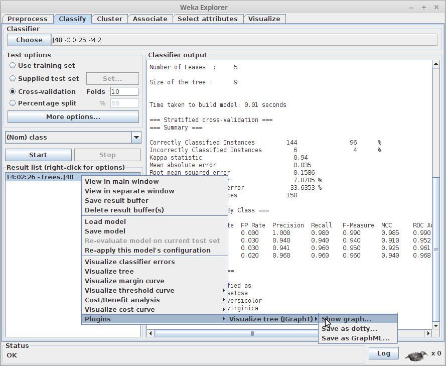
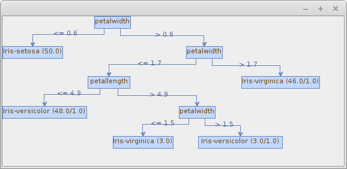
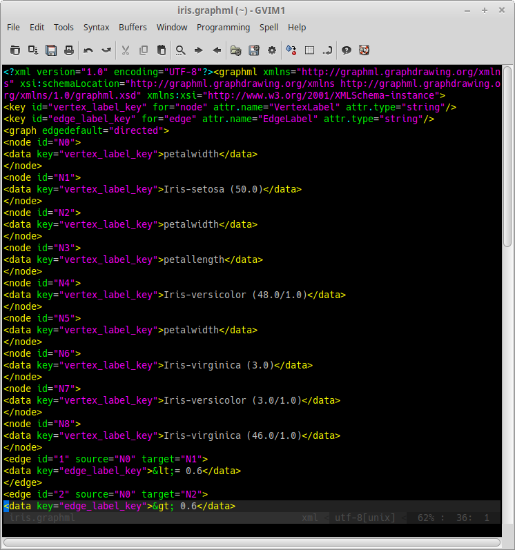

# jgrapht-treevisualize-weka-package

TreeVisualize plugin for the Explorer using [JGraphT](https://jgrapht.org/)
to generate the tree.

In contrast to [graphviz-treevisualize](https://github.com/fracpete/graphviz-treevisualize-weka-package),
this plugin does not rely on external tools and allows export to [GraphML](https://en.wikipedia.org/wiki/GraphML).


## Releases

* [2019.4.11](https://github.com/fracpete/jgrapht-treevisualize-weka-package/releases/download/v2019.4.11/graphviz-treevisualize-2019.4.11.zip) (Weka >= 3.7.11)

## How to use packages

For more information on how to install the package, see:

https://waikato.github.io/weka-wiki/packages/manager/


## Maven

Add the following dependency in your `pom.xml` to include the package:

```xml
    <dependency>
      <groupId>com.github.fracpete</groupId>
      <artifactId>jgrapht-treevisualize-weka-package</artifactId>
      <version>2019.4.11</version>
      <type>jar</type>
      <exclusions>
        <exclusion>
          <groupId>nz.ac.waikato.cms.weka</groupId>
          <artifactId>weka-dev</artifactId>
        </exclusion>
      </exclusions>
    </dependency>
```


## Screenshots

### Plugin menu



### Example graph

J48 tree generated from UCI dataset *iris*:



### GraphML export

[GraphML](src/site/resources/iris.graphml) generated from the original [dotty](src/site/resources/iris.dot):


